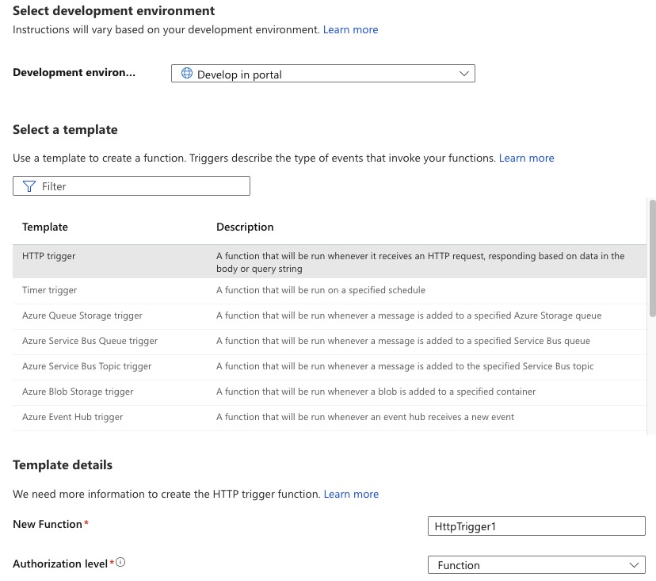

# Prisma Cloud Function to Syslog 

Version: *1.1*
Author: *Eddie Beuerlein, Marc Hobson, Sean Sullivan*

### Use Cases
- Can’t use AWS SQS integration because environment is Azure/GCP only
- Need to support a SIEM or other data ingestion tool that we currently don’t have a built-in integration available (currently we support Splunk, Jira and ServiceNow)
- Useful for anything that can ingest JSON data from a syslog message


### Requirements and Dependencies
- Syslog-NG, Rsyslog or equivalent: needs to support TCP delivery due to the size of the alert payload
- Serverless capability:
     - GCP Cloud Functions
     - AWS Lambda
     - Azure Functions
- SIEM/or other data ingestion tool that supports JSON based data (this could be other formats if there is a way to convert to them such as CEF or LEEF)
- Choose memory profile that meets your needs: 128MB is not very much


### Configuration
#### AWS Lambda Setup
- Create NEW Lambda Function
     - Paste Code
     - Save

- Configure Amazon API Gateway
     - Create NEW API Gateway
     - Build “HTTP API”
     - Click “Add Integration” Button
       - Integration Type: “Lambda”
       - Integration Target: your choice
       - Select the above created Lambda Function from the text box
       - Give the API a name
       - Select “Review and Create”
       - Copy the “Invoke URL” to use to test with curl or other source.

#### GCP Cloud Function Setup

- Create Function 
     - 
- Name function 
   - Set Memory allocated to 128mb
   - Set trigger to HTTP for use with a webhook.

- Use Inline Editor 
   - Select “Python 3.7” 
   - Paste code here 
   - Configure function to Execute as “main”. Finish by clicking “Create”.

- To attain the URL of the cloud function:
   - First click on the function
   - Select “Trigger” 
   - Copy the URL for use with the Prisma Cloud webhook integration.

#### Azure Function Setup

- Create a Function App
     - Publish: Code
     - Runtime stack: Python
     - Version: 3.9


- Go to created Function App, and go to "Functions"
     - Create 
     
     - Develop in Portal
     - HTTP trigger
          - Authorization level: Function
     
     - Code + Test 
          - Paste code here (overwrite all)
          - Save
     

#### VM machine / Syslog Server Setup

1. Any Linux server will work for this setup, but the syslog server does need to support TCP in order to handle the large alert payload from Prisma.  Rsyslog or SyslogNG work great in this scenario.  Rsyslog will be used in the setup example.

2. Configuring rsyslog.conf file:
Add to top of file (needed to handle large JSON alert payload):
```
$MaxMessageSize 64k
#need TCP enabled due to payload sizes of JSON data
$ModLoad imtcp
$InputTCPServerRun 514
#needs to match facility specified in python code
local3.*     /var/log/RedLock.log  
```
3. You may want to comment out the /etc/rsyslog.d/90-google.conf line as this can slow reception of the JSON messages or remove the file altogether.  NOTE this only affects GCP provided virtual machines. https://logrhythm.com/blog/troubleshooting-delayed-syslog-messages/

#### Prisma integration setup
1. https://docs.paloaltonetworks.com/prisma/prisma-cloud/prisma-cloud-admin/configure-external-integrations-on-prisma-cloud/integrate-prisma-cloud-with-webhooks

2. Insert Cloud Function trigger URL into the “Webhook URL” textbox

### Support
See the [support policy](SUPPORT.md).
